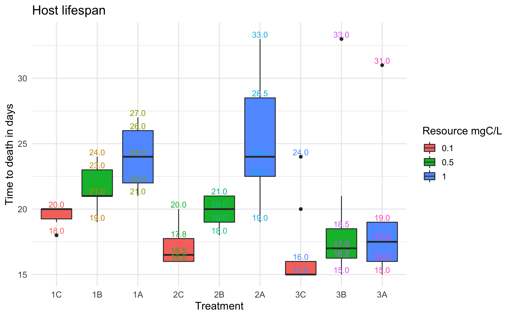
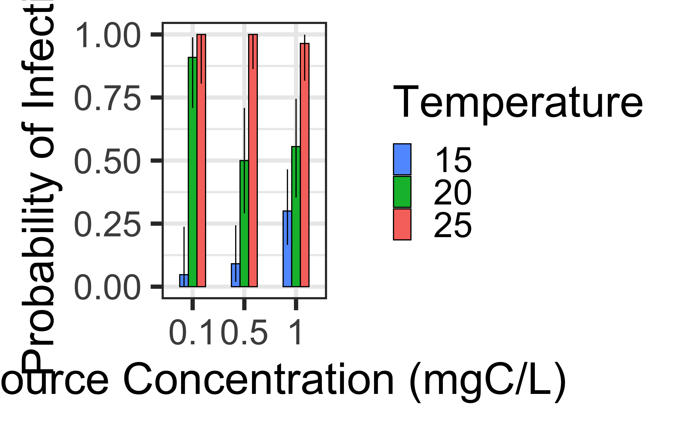
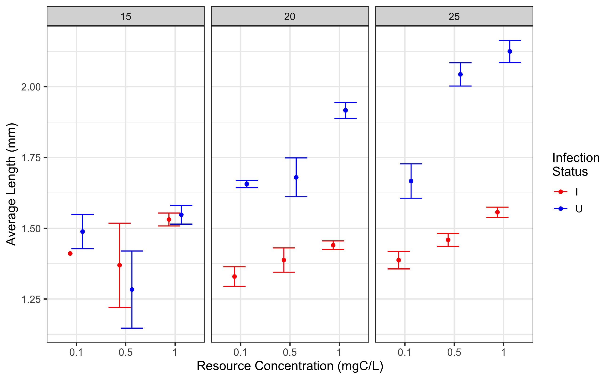
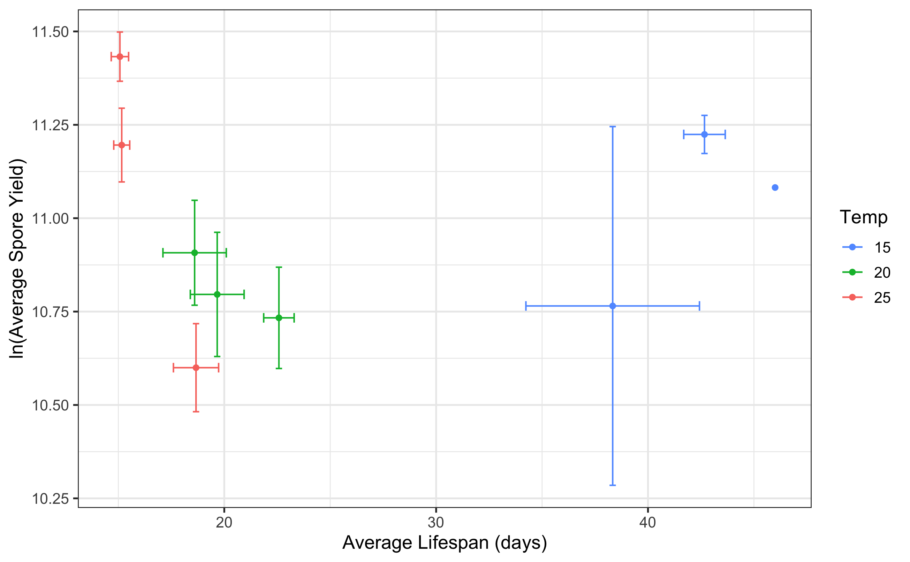
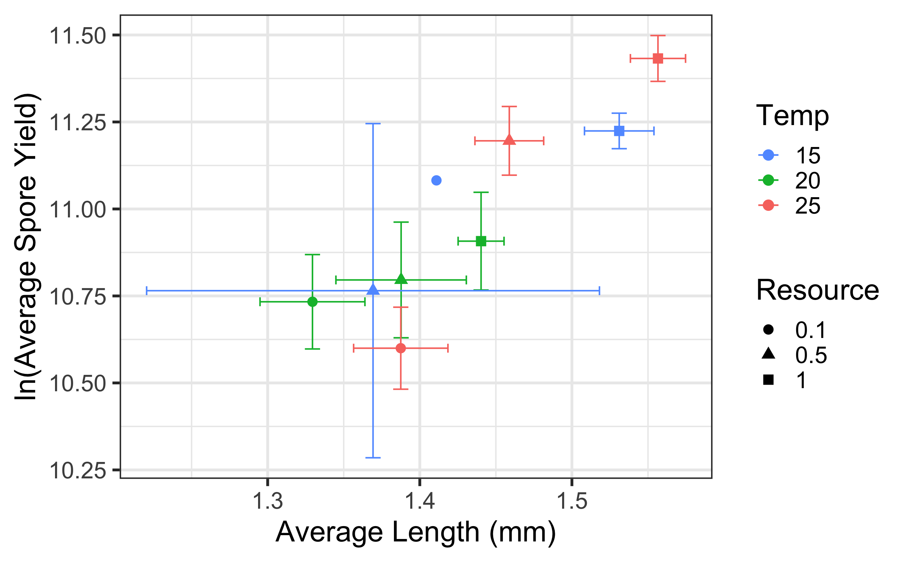
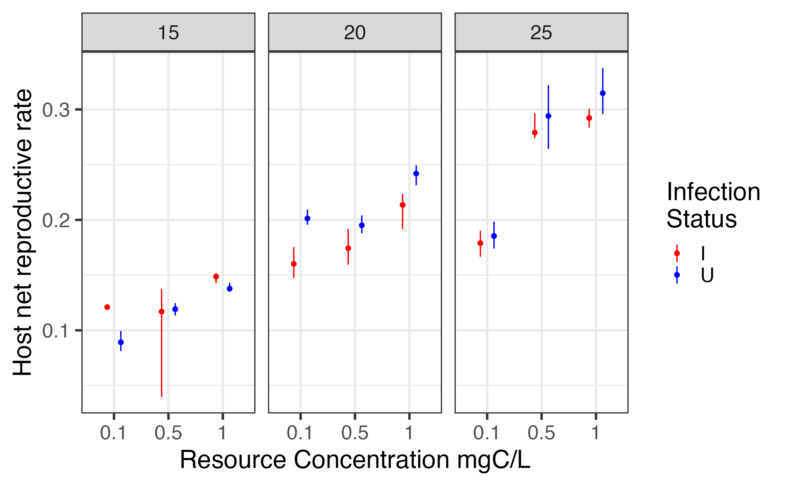

```{r setup, include=FALSE}
knitr::opts_chunk$set(echo = TRUE)
library(here)
```


Proposed Temperature and Resource Effects


Effects of temperature and resources on lifespan


Effects of temperature and resources on prevalence


Effects of temperature and resources on body size


Effects of lifespan on spore yield


Effects of length on spore yield


Effects of temperature and resources on host net reproductive rate



Effects of temperature and resources on parasite basic reproductive number


