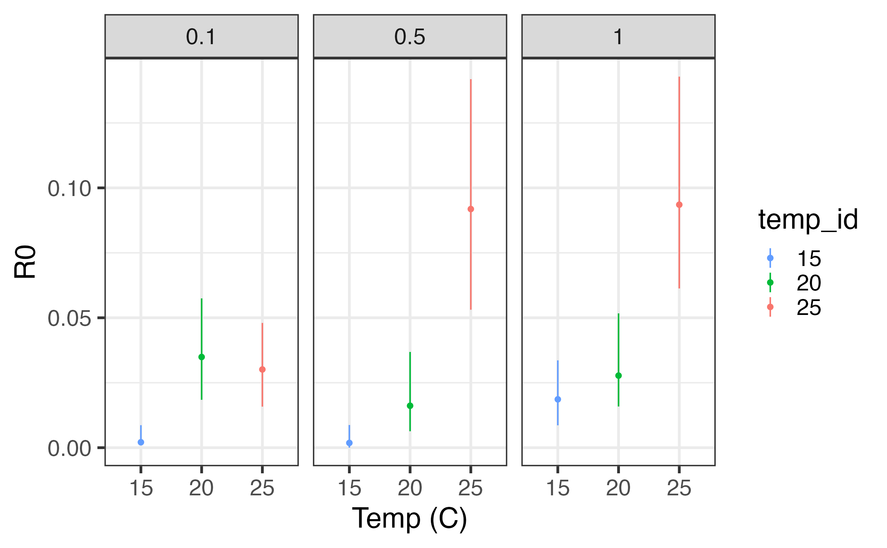
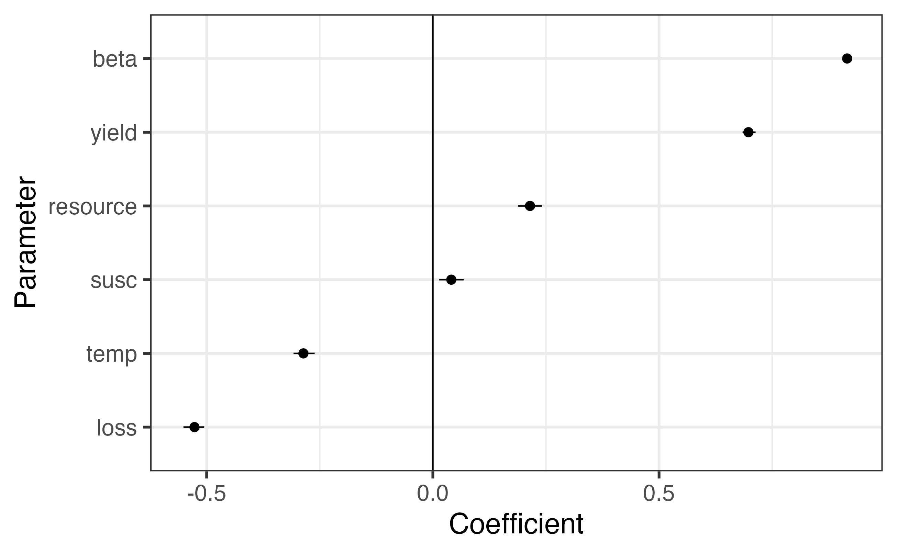

```{r setup, include=FALSE}
knitr::opts_chunk$set(echo = TRUE)
library(here)
```


# Effects of temperature and resources on prevalence

 - Probability of infection is consistent across resources at high temperature
 - Prob. of inf. decreases with increasing resources at 20 degrees but increases with increasing resources at 15 degrees


# Effects of temperature and resources on host net reproductive rate

 - Temperature and Resource availability have a positive effect on host net reproductive rate
 - In some cases, increases due to temperature can compensate for low resource availability
 - In some cases, resource availability appears to limit reproductive rates at higher temperatures
    - This appears to be the case when going from mid to high food at 20 degrees and low to mid food at 25 degrees


# Effects of resource and temperature on length and spore yield

 - Temperature and Resource concentration contributes to greater lengths and spore yields
 - Spore yield correlates with larger body sizes


# Effects of temperature and resources on parasite basic reproductive number

 - Temperature and resources combine to enhance the invasion potential of the parasite
 - At 20 degrees, higher resource concentration may reduce invasion potential
 - At 25 degrees, higher resource concentration enhances invasion potential
 



# Sensitivity of R0 to different parameters

 - R0 is most sensitive to changes in transmission rates
 - Temperature may have a negative effect on R0 via reductions in transmission rates 



