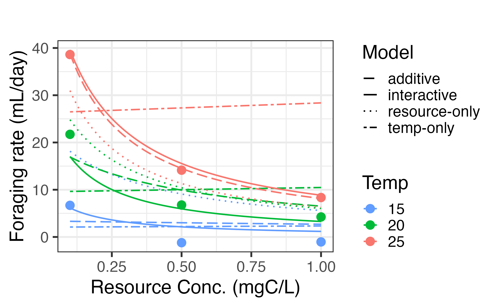
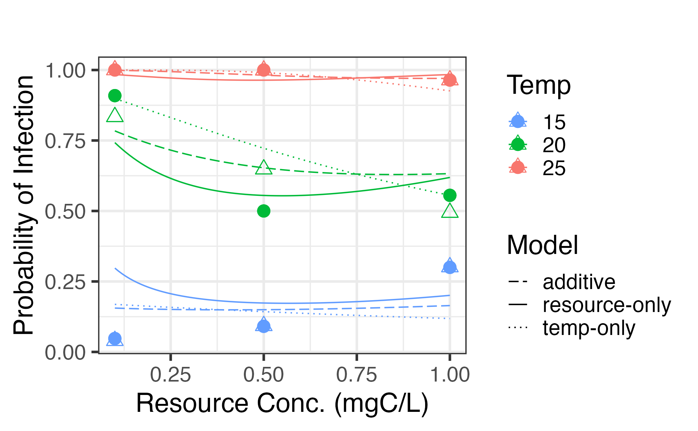
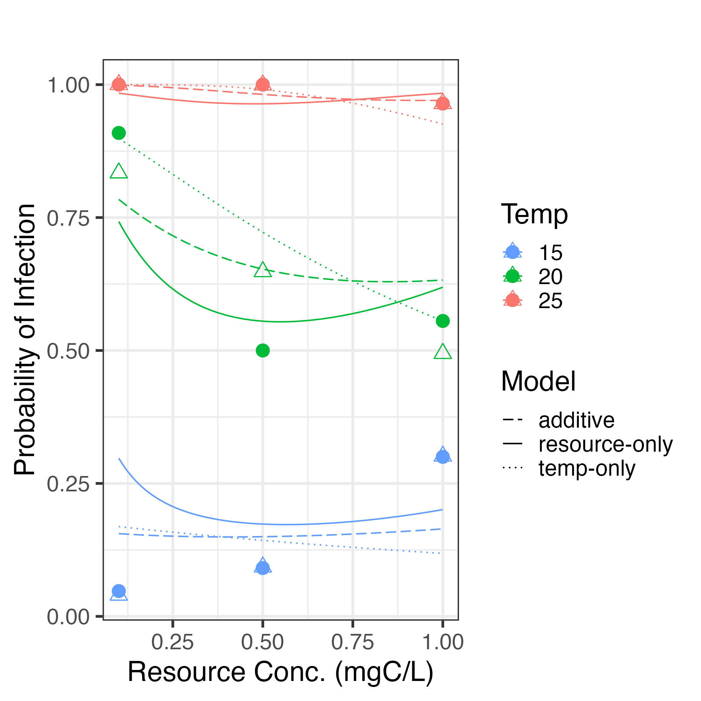
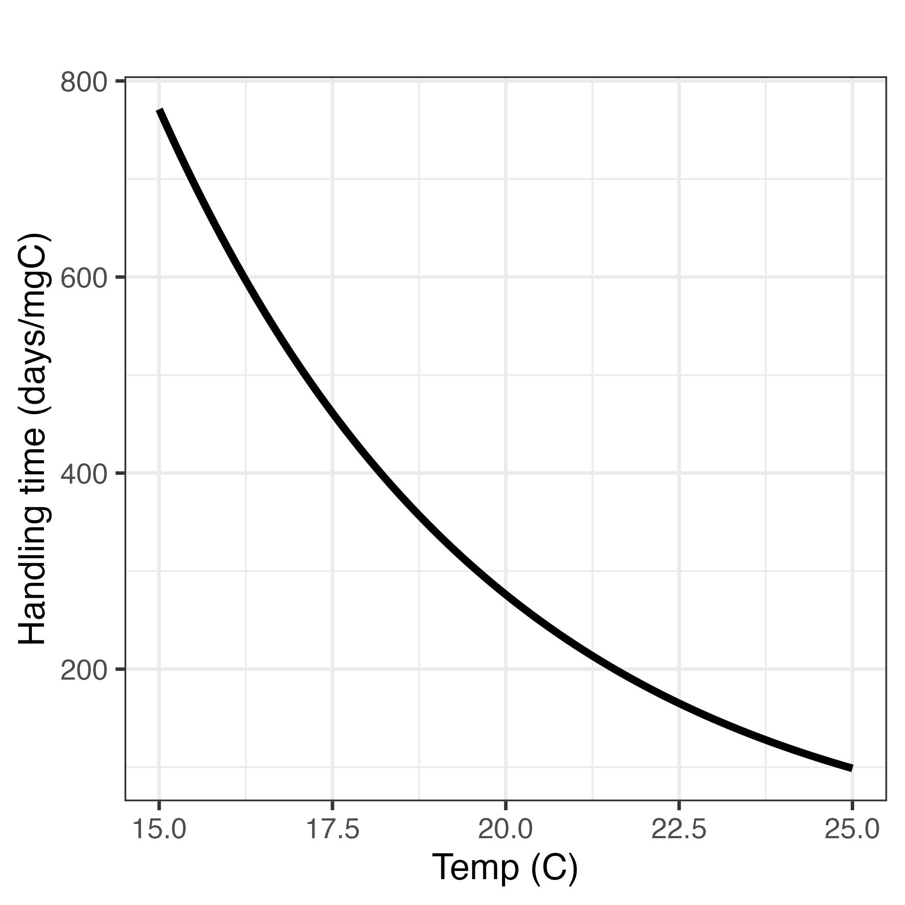

```{r setup, include=FALSE}
knitr::opts_chunk$set(echo = TRUE)
library(here)
```


# AIC Tables

We compared 5 models describing foraging rate patterns of daphnia under different temperature and resource conditions
(1) size-dependent effect only -- foraging rate is moderated by body size of the host according to a scaling exponent. All subsequent models include this effect.
(2) temperature-dependent effect -- foraging rate is altered by temperature according to an Arrhenius function
(3) resource-dependent effect -- foraging rate is altered by resource concentration according to a type-II functional response
(4) additive effect -- foraging rate is altered by both temperature and resource effects
(5) interactive effect -- foraging rate is altered by both temperature and resource effects and the resource effect changes as an exponential function of resources
```{r}
readRDS(here("mle", "aic_table_f_final.rds"))
```

We estimated the prevalence of infection from an infection assay as a function of foraging rate and per-spore susceptibility under the same temperature and resource conditions. We compared 5 models. Each incorporates the best fitting foraging rate model.
(1) constant -- per-spore susceptibility is constant across all temperature and resource conditions
(2) temperature-dependent effect -- foraging rate is altered by temperature according to an Arrhenius function
(3) resource-dependent effect -- foraging rate is altered by initial resource concentration as an exponential function
(4) additive effect -- foraging rate is altered by both temperature and resource effects
(5) interactive effect -- foraging rate is altered by resource effects and is evaluated at each temperature
```{r}
readRDS(here("mle", "aic_table_combined_final.rds"))
```


# Foraging rate fits




# Prevalence fits




# per-spore susceptibility across temperature



# Temperature-dependent handling time




